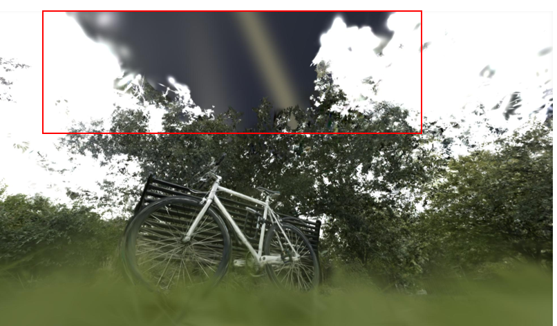
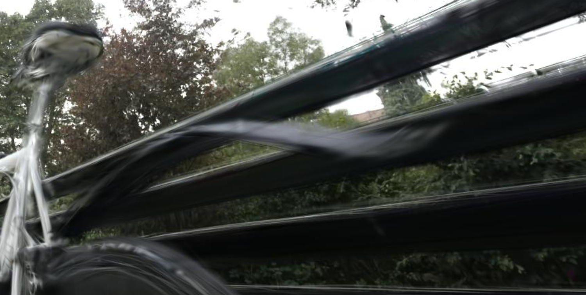
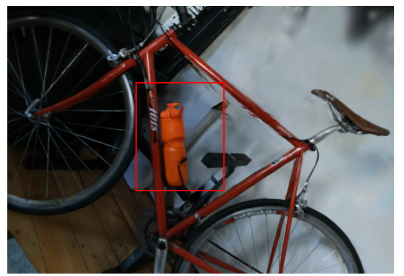
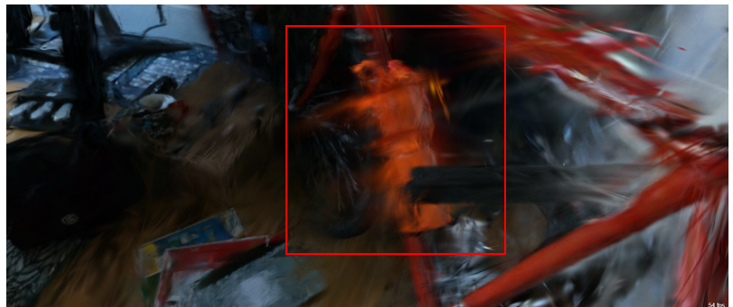
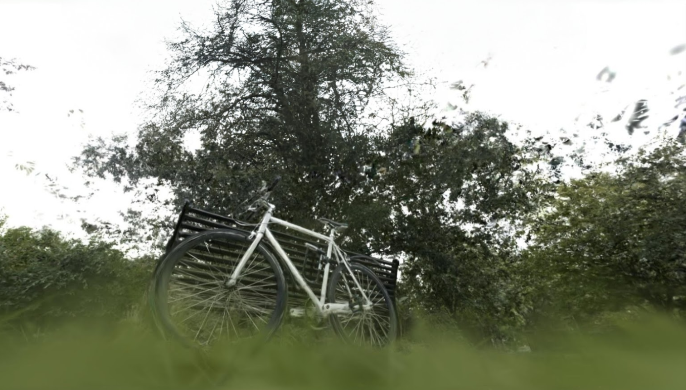
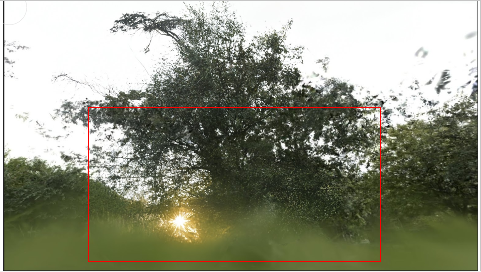
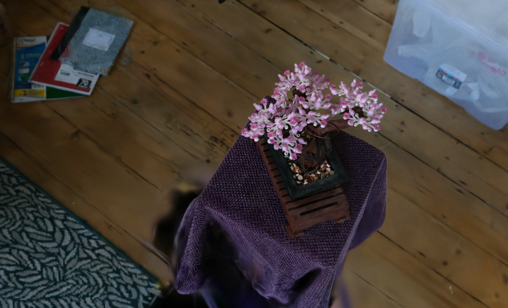
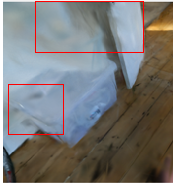
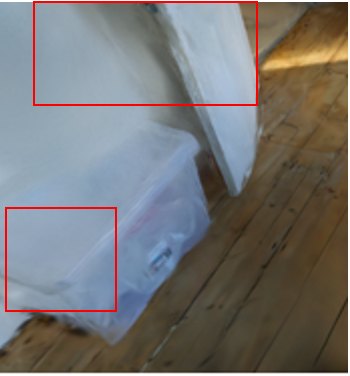
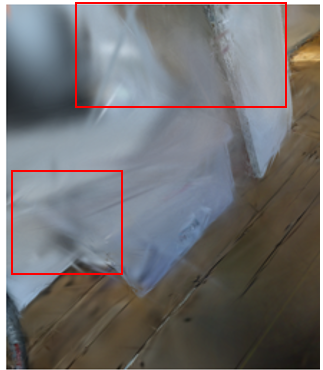

## Abstract

Gaussian splatting is an innovative approach to scene rasterization, utilizing Gaussian functions as input primitives instead of traditional geometric representations like polygons or voxels. Departing from conventional rendering techniques, this method projects 3D Gaussian distributions directly into 2D space as smooth, continuous blobs. This process significantly enhances rendering efficiency, providing smoother visual outputs while achieving substantial speed improvements by allowing for parallelized computing. These advantages position Gaussian splatting as a promising technique for real-time applications such as augmented reality, virtual reality, and video games, where achieving low-latency rendering is of paramount importance.

In this work, we review existing methods for rendering 3D scenes from multiple views. We analyze the techniques presented in the original 3D Gaussian Splatting paper and highlight its limitations and potential extensions.

## Contribution
- **Under-represented viewpoints**: Missing viewpoints in the scene result in holes in the 3D reconstruction (see Section~\ref{section:limitation-black}). We addressed this by using generative image techniques to fill in these gaps (see Section~\ref{section:extension-black-patches}).
- **Rendering boundaries and discontinuities**: 3D Gaussian Splatting struggles to accurately render sharp boundaries and discontinuities (see Section~\ref{sec:render-boundaries-discon}).
- **View artifacts and chromatic aberrations**: Artifacts and aberrations appear under certain angles (see Section~\ref{sec:view-artifacts}). To mitigate this, we experimented with adding noise and adjusting the degree of spherical harmonics (see Section~\ref{sec:colors-expe}).
- **Depth regularization**: We introduced depth information to the input images to regularize the training process and improve results (see Section~\ref{sec:depth-regu}).
- **SfM solver comparison**: We compared more extensively than the original paper the performance of two SfM solvers, GLOMAP and COLMAP, to evaluate their impact on Gaussian Splatting (see Section~\ref{sec:sfm-solver}).

## Related Works
Prior to the emergence of Gaussian splatting, two primary approaches dominated the synthesis of novel views from input images: Neural Rendering and Radiance Fields (e.g., NeRF), and Point-based Rendering.

### Point-Based Rendering
Point-based methods efficiently render disconnected geometric samples by computing a point cloud. Each point represents a shape that spans more than a pixel, such as circular or elliptical representations. While faithful to the underlying data, point samples suffered from discontinuities and visible holes. There have also been efforts to augment points with neural features to enhance rendering. Although these methods share similarities with the foundational ideas of Gaussian splatting, they lacked a ready-to-use, fast rendering algorithm like the one proposed in the initial Gaussian splatting paper.

### Neural Rendering and Radiance Fields
Deep learning methods for novel-view synthesis were adopted early, with CNNs used to estimate blending weights. Then, Neural Radiance Fields (NeRF) introduced techniques like importance sampling and positional encoding to enhance quality but relied on large networks, which significantly impacted computational speed. The success of NeRF spurred an explosion of follow-up methods, with MiP-NeRF360 representing the state of the art at the time. While achieving impressive rendering quality, these methods required extensive training and relied on computationally expensive sampling during rendering.

To address these limitations, Instant NGP introduced hash grids and occupancy grids to accelerate computation. Similarly, Plenoxels leveraged a sparse voxel grid to interpolate a continuous density field. These approaches were the primary solutions for engineers prior to the publication of the 3D Gaussian Splatting method. The 3D Gaussian Splatting approach further improved on these techniques by offering significantly faster training and rendering times compared to traditional NeRF methods.

## Target Applications for this method
This method is applicable to various domains aiming to generate 3D scenes from images. For instance, gaming and virtual reality, where 3D Gaussian splatting enhances the rendering of complex environments. Its ability to handle large-scale 3D data at real-time speeds with smooth transitions between objects and surfaces makes it ideal for immersive experiences, such as VR simulations or augmented reality interfaces, where responsiveness and visual fidelity are critical.

Another significant application lies in autonomous systems and robotics, where 3D Gaussian splatting can be used for real-time scene reconstruction and mapping without any need for heavy sensors. Moreover, in medical imaging, this technique can help with novel Computed Tomography projections, but it should be noted that applying SfM to computed tomography images is especially challenging.

There are many uses for this technique in digital twins, where high-precision 3D duplicates of real-world objects are required for simulation in real-time tasks.

## Method
### Gaussian: a building block of 3D Gaussian 

The fundamental building block of this paper is the 3D Gaussian. One of
the key properties of Gaussians is that 3D Gaussians can be projected
and rendered as 2D Gaussians. Each gaussian will
be represented with a covariance matrix $\Sigma$, a mean $\mu$, an
opacity $\alpha$ and colors:
$$\mathcal{G}(x)=exp(-1/2(x)^{T}\times \Sigma^{-1}(x))$$

The corresponding 2D Gaussian for rendering is a Gaussian with
covariance $\sigma'$ given by : $$\sigma'= JW\Sigma W^T J^T$$ with the
corresponding Jacobian J of the projective transformation and W the
viewing transformation. Opacity $\alpha$ and colors will be used later.
### Storing RGB value for every Gaussian

To encode color information, each Gaussian stores view-dependent RGB
values using spherical harmonics along with an opacity value, $\alpha$.
\"Spherical harmonics\" are a widely used method for
representing colors on 3D objects, allowing the color to vary depending
on the camera's viewpoint.

Mathematically, we store the spherical harmonics up to a maximum degree
$l_{max}$. If we denote the view direction of point $i$ in image $j$ as
$v_{i}^{j}$ Then the color of the point is
given by :
$$c_{i}^{j} = \sum_{l=0}^{l_{max}} \sum_{m=-l}^{l} c_{m}^{l}*\times Y^{m}_{l}(v_{i}^{j})
    \label{SH_eq}$$ $c_{m}^{l}$ is a learnable parameter per gaussian
with $Y^{m}_{l}(v_{i}^{j})$, the corresponding spherical harmonics.\

### Rendering {#rendering}

To determine which pixels a Gaussian in 3D space will impact, we compute
its projection onto the 2D image plane. For a Gaussian and an image $j$,
its projection $p_{ij}$ is calculated in 2D space, along with its 2D
covariance matrix $\sigma'$. If the projection falls within the image
boundaries, we calculate a rectangle based on the eigenvalues of the
covariance matrix $\sigma'$. This rectangle defines the region of the
image influenced by the Gaussian during rendering.\
Since multiple Gaussians can influence the same pixel in a 2D image, it
is necessary to introduce a parameter to control how these Gaussians
interact in the pixel space. To address this, the authors included an
$\alpha$ parameter, which determines the contribution of each Gaussian
to the final color of the pixel.

The final color of a pixel $i$ in an image $j$ is given by:
$$c_{i}^{j}= \sum_{i=1}^{N} c_{i} \alpha_i \prod_{j=1}^{i-1}(1-\alpha_j), %THIS IS FALSE SEE https://github.com/hbb1/torch-splatting/blob/main/gaussian_splatting/gauss_render.py$$

where $\alpha_i$ represents the opacity weights, and $N$ is the number
of Gaussians whose rectangles intersect the pixel in the image space,
sorted depth-wise.

### Rasterization and backpropagation

Since 2D images must be generated repeatedly from the 3D scene, a fast
algorithm for rasterization is essential. The main goal is to balance
quality with speed while maximizing the parallelization of the rendering
process. In the original paper, the authors divided the 2D screen into
$n \times n$ tiles and retained only the Gaussians likely to fall within
the view frustum. For each tile, they processed every pixel within it,
sorting the Gaussians by depth and accumulating the color and alpha
values depth-wise (from front to back). The process stops once the
accumulated alpha value in a pixel reaches a saturation threshold
$\alpha$. Unlike traditional ray tracing methods, this approach does not
rely on sampling and uses saturation as the sole stopping criterion.

In the backpropagation step, the per-pixel loss must be converted into
the 3D Gaussian space. For each tile, the process starts with the last
Gaussian that affected any pixel. Each pixel then tests and processes
Gaussians whose depth is less than that of the last contributing
Gaussian. This approach enables direct differentiation, ensuring
efficient gradient computation.

## Limitation 
### "Holes" Due to Missing Camera Views
A notable limitation of Gaussian splatting is the appearance of "holes," rendered as black patches in regions not observed by the training camera. Since Gaussian splatting relies on information from multiple viewpoints to reconstruct the scene, areas outside the field of view of the training images lack the necessary data to generate accurate visual representations. Consequently, these regions remain undefined or are rendered as black patches, as the algorithm cannot infer color or texture without sufficient spatial information. This limitation underscores a fundamental challenge in 3D reconstruction and view synthesis: the output quality is heavily dependent on the completeness of input camera coverage during training, with no extrapolation from other parts of the scene.

In practice, these missing regions could provide an important signal to users, highlighting areas where additional camera views are required. Identifying such gaps could prompt users to capture supplementary imagery, thereby improving the reconstruction.

### Difficulty Rendering Boundaries and Discontinuities
The Gaussian splatting algorithm also faces challenges in handling discontinuities and boundaries, particularly at the edges between objects. These discontinuities are common in scenes with sharp transitions between objects or materials, where the smooth, probabilistic nature of Gaussian splatting fails to accurately capture abrupt changes in geometry or color.

A plausible explanation for this limitation is that the Gaussian splatting algorithm inherently assumes a degree of continuity in the spatial distribution of Gaussians. While this assumption performs well for smooth surfaces, it proves insufficient for accurately representing sharp edges.

### Color artifacts in Rendered Viewpoints
In this section, we detail several color anomalies observed while exploring the rendered scenes.

First, as described in , spherical harmonics provide a view-dependent color representation. While this approach is effective for thoroughly scanned 3D objects, visualizing novel viewpoints not captured during scanning can result in blurry artifacts.

Additionally, the blending of Gaussians at object boundaries can introduce chromatic aberrations, which hinder high-fidelity reconstruction in scenes with complex structural details.

Furthermore, in regions with sparse or no training views, black specks (Gaussian artifacts) were observed in areas devoid of objects.

We hypothesize that these issues arise because the Gaussians are optimized specifically for rendering the training scenes, without fully capturing the true 3D structure of the environment.

## Extensions

### Fixing the Black Patches Issue with Generative Image Generation 

Under-represented viewpoints
often result in black patches. To address this in a post-processing
step, we experimented with generative image libraries like Stable
Diffusion  to fill in the gaps for key images.
Initially, on
Figure we used a fixed prompt---\"fill in the
missing black sections\"---to seamlessly complete the image. However,
this approach produced incorrect results, as it inadvertently removed
objects such as bicycle tires and benches. We suspect the model interpreted
the black areas too broadly.

To improve the output, we refined the prompt to make it more
context-specific, changing it to \"fill in the missing black sky\". This
adjustment led to a more satisfactory result, as it focused the model's
attention on the sky, preserving other key elements of the image.

While this method offers some improvement, it has significant
limitations: it can only be applied to one image at a time at the end of
the pipeline and must be repeated for each new viewpoint. A potential
solution to this issue would involve retraining the model using these
example-filled images. However, developing the algorithm to find the
appropriate prompts and integrating these images into the training
process is beyond the scope of this paper, though it presents a
promising direction for future work.

First try of filling gaps in images with Stable Diffusion with the
prompt:\" fill in the missing gap sections\". The input image is
figure, the bike is not present
anymore.
{#fig:sky-filled width="90%"}

Result with a more fine-tuned prompt: \"Fill in the black sky\". The
bike is back again.
<figure id="fig:test">
    
    <figcaption> Input Images, a black hole  can be seen </figcaption>
  
  <figcaption> Input naive prompt: " fill in the black patches" </figcaption>
  
  <figcaption> More complex prompt:" fill in the missing sky" </figcaption>
<figcaption>Results of our experiments.</figcaption>
</figure>

## Color and Boundary Repair Experiments {#sec:colors-expe}

### Adjusting Spherical Harmonics Parameter

As discussed in
Section , spherical harmonics can introduce
chromatic aberrations or blurry artifacts. To address this issue, we
experimented with modifying the degree of spherical harmonics for each
Gaussian, testing values of 1 and 2. However, overall, we did not
observe significant visual differences.
We hypothesize that the large number of Gaussians in the scene
(approximately 1.2 million) compensates for any potential loss of color
information.

<figure id="fig:">
  

<figcaption>Scene rendered changing the number of spherical harmonics.
No major changes can be seen. </figcaption>
</figure>

### Effects of adding noise on images before training {#section:noise_adding}

In this section, we explored the impact of introducing noise to the
input images. Specifically, we added salt-and-pepper noise
 with probabilities $p = 0$, $p = 0.05$, and
$p = 0.2$. The resulting loss values were affected.. While some colors became slightly
desaturated, the 3D scenes were still reconstructed correctly. We
hypothesize that the diversity of input images compensates for the added
noise, suggesting that the quantity of images plays a more critical role
in maintaining reconstruction quality than the individual image
fidelity.

Furthermore, as discussed in
Section , we hypothesized that adding
Gaussian noise to colors could act as a smoothing parameter by
distorting details. This smoothing effect could potentially soften hard
edges, thereby simplifying the geometry for the Gaussians to learn. Our
observations  confirmed that adding noise with a small
magnitude helped better reconstruct edges, such as those between the
box, the door and the wall, as well as the upper part of the door.
However, increasing the noise magnitude too much ultimately degraded the
geometry of the edges. Based on these findings, we conclude that
introducing noise to input images can serve as a useful parameter for
improving the algorithm's ability to learn sharp geometries at a
relatively low computational cost.

<figure id="fig:additional_fig">
    
    <figcaption> Input Images without any noise </figcaption>
  
  <figcaption> Bonsai with a noise of 0.05</figcaption>
  
  <figcaption> Bonsai with a noise of 0.2
<figcaption>Scenes rendered with varying levels of salt-and-pepper
noise. As the noise probability <em>p</em> increases, the boundaries become
smoother and more defined, enhancing clarity. However, excessive noise
(e.g., <em>p</em> = 0.2) leads to
significant loss of detail and color fidelity, resulting in desaturation
and visual degradation across the image.</figcaption>
</figure>

# Conclusion

This paper provides a comprehensive analysis of 3D Gaussian Splatting,
highlighting its limitations and proposing several extensions to address
these challenges. Key limitations identified include the appearance of
black patches in unobserved regions, difficulties in rendering sharp
boundaries, and color artifacts in novel viewpoints. To mitigate some of
these issues, we proposed a variety of solutions, such as using
generative image techniques to fill in missing viewpoints, incorporating
depth regularization during training, modifying the
structure-from-motion (SfM) solver, adjusting spherical harmonics to
reduce artifacts, and introducing noise to input images to test the
model's robustness. For future work, we plan to investigate the
potential of Gaussian Splatting for 3D mesh reconstruction, seeking to
extend its utility beyond rendering tasks.

<figure id="fig:lossnoise">

